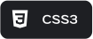
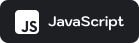
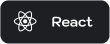

---

Я начинающий веб-разработчик.

Вначале я не думал, что меня затянет кодинг. Я просто хотел написать один маленький код на пару строк. Друзья говорили, что это временно, но меня все не отпускало. После первого "Hello world" я уже не смог остановится. Я и не заметил, как через короткое время я начал писать код ночью на кухне после работы. Сейчас я читаю книгу по алгоритмам и не думаю, что смогу перестать.

---

 

 Technology stack

 

---

 

 React projects

     
  

      
     
    <a href="https://github.com/Zhdko?tab=repositories">
  

  

 

##  Моя статистика

 

  
  

---
